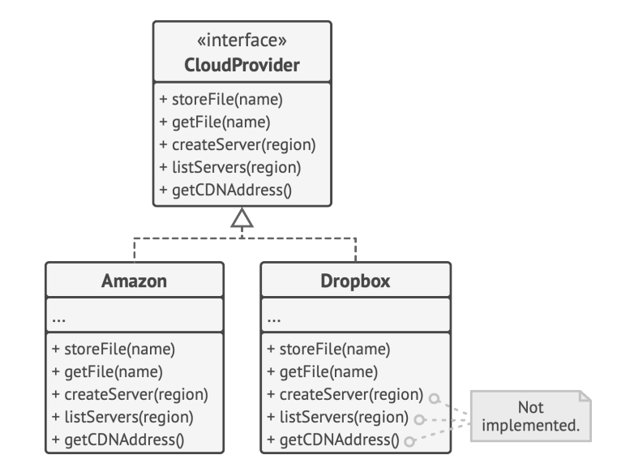
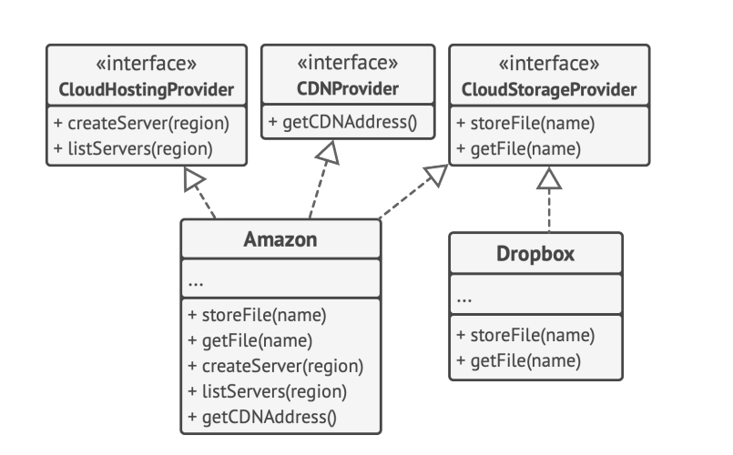

### Muayyan mijoz uchun mo'ljallangan yuqori ixtisoslashtirilgan interfeyslarni yarating. Mijozlar o'zlari foydalanmayotgan interfeyslarga bog'liq bo'lmasligi kerak.

### Bizda 2ta sinf bor:
### 1. Amazon
### 2. Dropbox

### va bitta interfeysimiz bor 

### 2. Dropbox sinfimiz CreateServer, ListServers, getCDNAddress metodlarini implemented qilmaydi

shun biz quyidagi rasmdagi kabi interfeyslarga bo'lib chiqdik

## kodimiz:

